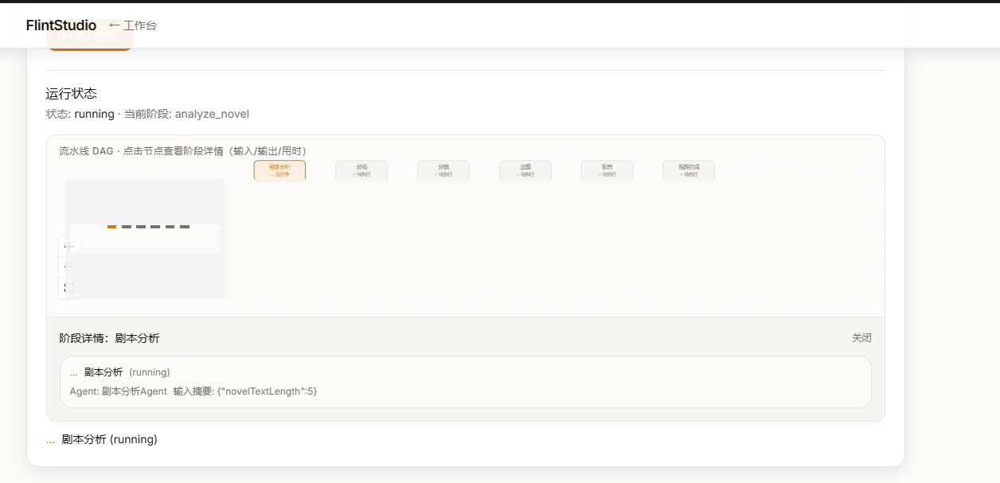

<p align="center">
  
  
  
</p>

<h1 align="center">🔥 FlintStudio</h1>
<p align="center">
  <strong>从小说到成片，一条龙 AI 影视流水线 · Novel to Video in One Click</strong>
</p>
<p align="center">
  <strong>全 API 可配置 · 多 Agent 自动协同 · 无厂商锁定</strong><br />
  <strong>Fully configurable APIs · Multi-agent automation · No vendor lock-in</strong>
</p>

<p align="center">
  <a href="#-功能--features">功能</a> •
  <a href="#-架构示意图--architecture">架构</a> •
  <a href="#-预览--preview">预览</a> •
  <a href="#-快速开始--quick-start">快速开始</a> •
  <a href="#-通过-openclaw-ai-部署--deploy-with-openclaw-ai">AI部署</a> •
  <a href="#-文档--documentation">文档</a> •
  <a href="#-配置--configuration">配置</a> •
  <a href="#-流程--workflow">流程</a> •
  <a href="#-技术栈--tech-stack">技术栈</a> •
  <a href="#-联系方式--contact">联系方式</a>
</p>

---

## 💬 有问题或建议？· Questions or feedback?

**中文**  
无论发现 Bug、功能建议，还是单纯不知道如何使用，都欢迎：
- **GitHub Issues**（推荐）：[点击新建 Issue](https://github.com/Flintcore/FlintStudio/issues) —— 可以用**中文**或英文提问，不用在意格式！
- 或者加入讨论社区：https://community.phantomcore.ai/

> 💡 **新手提示**：不用担心问题太「小白」，每个 issue 都会让这个项目变得更好！

**English**  
Found a bug, have a feature idea, or just not sure how to use something? We’d love to hear from you:
- **GitHub Issues** (recommended): [Open a new issue](https://github.com/Flintcore/FlintStudio/issues) — feel free to write in **Chinese** or English; no format rules!
- Or join the community: https://community.phantomcore.ai/ 

> 💡 **New here?** No question is too basic — every issue helps make this project better!

---

## 📖 简介 · About

**中文**  
FlintStudio 是一款**开源、可自托管**的 AI 影视自动化平台。粘贴小说或剧本，一键启动工作流，系统将**自动按 DAG 执行**：剧本分析 → 分场 → 分镜 → 出图 → 配音 → 视频合成，无需逐步点击。所有 AI 服务（LLM、图像、TTS）均在「设置」中配置 Base URL 与 API Key，**无厂商绑定**，可对接 OpenRouter、OpenAI、自建端点等，面向从短剧到成片的完整流水线。

**English**  
FlintStudio is an **open-source, self-hosted** AI film automation platform. Paste a novel or script, hit one button, and the pipeline **runs automatically**: script analysis → scene splitting → storyboard → image generation → voiceover (TTS) → video composition (FFmpeg). No clicking through each step. All AI services (LLM, image, TTS) are configured in Settings with your own Base URL and API Key—**no vendor lock-in**. Use OpenRouter, OpenAI, or any compatible endpoint for a full novel-to-video workflow.

---

## 🏗️ 架构示意图 · Architecture

**中文**  
一键生成时，工作流按以下 DAG 顺序自动执行，每阶段由对应 Worker 完成任务后推进下一阶段。

**English**  
When you trigger one-click generation, the workflow runs in this order; each phase advances automatically after its workers complete.


**中文**  
系统组件：Next.js 提供 Web 与 API；BullMQ Worker 消费 Redis 队列执行各阶段任务；MySQL 存项目/集/分场/分镜等；LLM、图像、TTS 为设置中配置的外部 API。

**English**  
Components: Next.js serves the UI and API; BullMQ workers consume Redis queues for each phase; MySQL stores projects, episodes, clips, storyboards; LLM, image, and TTS call your configured external APIs.

--- 

## 🖼️ 预览 · Preview

**中文**  
下方为产品界面与成片效果预览。

**English**  
Preview of the UI and generated video.

<p align="center">
  
</p>

*预览图：`docs/preview2.png` / Preview: `docs/preview2.png`*

---

## ✨ 功能 · Features

**中文**

| 功能 | 说明 |
|------|------|
| 🎬 **多 Agent 自动工作流** | 类似 Dify/n8n：一键粘贴后按 DAG 自动执行，Worker 完成即推进下一阶段 |
| 📜 **剧本分析** | LLM 解析小说 → 角色、场景、集数落库（可配 OpenRouter / 自建） |
| 📑 **分场** | 每集正文 → LLM 拆分为多场（摘要、场景、人物、正文）→ Clip |
| 🎞️ **分镜** | 每场 → LLM 拆分为多镜头（描述、绘图提示）→ Storyboard + Panel |
| 🖼️ **分镜出图** | 每镜头调用可配置图像 API 生成分镜图并写回 Panel |
| 🎙️ **配音** | 提取对白（LLM）→ 可配置 TTS 生成每条音频 → VoiceLine |
| 🎥 **视频合成** | 分镜图 + 配音经 FFmpeg 合成为一集 MP4 → Episode.videoUrl |
| ⚙️ **设置中心** | 所有 API（LLM、图像、语音）Base URL + API Key 在设置中配置 |
| 🤖 **OpenClaw Skill** | 支持通过 OpenClaw 龙虾 AI 一键部署、配置、诊断、维护 |

**English**

| Feature | Description |
|---------|-------------|
| 🎬 **Multi-agent workflow** | Dify/n8n-style: paste once, DAG runs automatically; workers advance to the next stage on completion |
| 📜 **Script analysis** | LLM parses novel → characters, locations, episodes persisted (OpenRouter / self-hosted) |
| 📑 **Scene splitting** | Per-episode text → LLM splits into scenes (summary, location, characters) → Clip |
| 🎞️ **Storyboard** | Per scene → LLM splits into panels (description, image prompt) → Storyboard + Panel |
| 🖼️ **Panel images** | Configurable image API generates one image per panel → Panel.imageUrl |
| 🎙️ **Voiceover** | Extract dialogue (LLM) → configurable TTS per line → VoiceLine.audioUrl |
| 🎥 **Video composition** | FFmpeg merges panels + voice into one MP4 per episode → Episode.videoUrl |
| ⚙️ **Settings** | All APIs (LLM, image, TTS) configured via Base URL + API Key in Settings |
| 🤖 **OpenClaw Skill** | One-click deploy, configure, diagnose and maintain via OpenClaw AI |

---

## 🚀 快速开始 · Quick Start

以下为**零基础可跟做**的 Docker 部署教程，从安装 Docker Desktop 到在浏览器里打开 FlintStudio。  
Below is a **beginner-friendly** deployment guide from installing Docker Desktop to opening FlintStudio in your browser.

---

### 中文版：小白部署教程

#### 第一步：安装 Docker Desktop

Docker Desktop 是一个用来运行 FlintStudio 及其依赖（MySQL、Redis）的桌面软件。

1. **打开官网**：在浏览器中访问 [https://docs.docker.com/get-docker/](https://docs.docker.com/get-docker/)。
2. **选择系统**：
   - **Windows**：点击 “Docker Desktop for Windows”，下载安装包并运行。若提示需要 WSL 2，按页面说明启用即可。
   - **macOS**：根据芯片选择 “Apple chip” 或 “Intel chip”，下载 `.dmg` 并安装。
3. **安装完成后**：从开始菜单（Windows）或应用程序（Mac）打开 **Docker Desktop**，等待托盘/菜单栏出现 Docker 图标并显示 “Docker Desktop is running”。
4. **（可选）注册账号**：首次打开可能提示登录 Docker 账号，可先跳过，不影响本地使用。

#### 第二步：安装 Git（若尚未安装）

用来下载 FlintStudio 的代码。若你已能使用 `git` 命令，可跳过。

- **Windows**：到 [https://git-scm.com/download/win](https://git-scm.com/download/win) 下载并安装，安装时默认选项即可。安装完成后**重新打开**终端/PowerShell。
- **macOS**：终端中执行 `xcode-select --install`，或从 [https://git-scm.com/download/mac](https://git-scm.com/download/mac) 安装。

#### 第三步：获取 FlintStudio 代码

1. 打开**终端**（Windows：在开始菜单搜 “PowerShell” 或 “终端”；Mac：打开 “终端” 或 “Terminal”）。
2. 输入下面命令并回车，把项目下载到当前目录下的 `FlintStudio` 文件夹：

```bash
git clone https://github.com/Flintcore/FlintStudio.git
```

3. 进入项目目录：

```bash
cd FlintStudio
```

（以后若要更新代码，在该目录下执行 `git pull` 即可。）

#### 第四步：用 Docker 启动服务

1. 确保 **Docker Desktop 已运行**（托盘/菜单栏有 Docker 图标）。
2. 在终端中确认当前在 `FlintStudio` 目录（可再执行一次 `cd FlintStudio`），然后执行：

```bash
docker compose up -d
```

3. **首次运行**会下载镜像并构建应用，可能需要几分钟。看到类似 “flintstudio-app … Started” 或没有报错即表示启动成功。
4. 若出现端口被占用等错误，可先执行 `docker compose down` 再重试 `docker compose up -d`。

#### 第五步：在浏览器中打开 FlintStudio

1. 打开浏览器，在地址栏输入：**http://localhost:13000** 并回车。
2. 若页面能打开，说明部署成功。**当前版本打开即进入工作台**，无需登录。
3. 接下来可以：**新建项目** → 在「一键生成」框里**粘贴小说或剧本文本** → 点击 **启动工作流**。
4. **使用前请先配置 API**：进入 **设置 → API 配置**，填写大语言模型、图像生成、语音合成的 Base URL 与 API Key（见下方 [配置](#-配置--configuration) 小节），否则工作流无法完成出图、配音等步骤。

---

**中文小结**：安装 Docker Desktop 和 Git → `git clone` 拉取代码 → `cd FlintStudio` → `docker compose up -d` → 浏览器打开 http://localhost:13000 → 设置里配好 API 即可使用。

---

### English: Beginner deployment guide

#### Step 1: Install Docker Desktop

Docker Desktop runs FlintStudio and its dependencies (MySQL, Redis) on your machine.

1. **Open**: [https://docs.docker.com/get-docker/](https://docs.docker.com/get-docker/).
2. **Choose your OS**:
   - **Windows**: Download “Docker Desktop for Windows” and run the installer. Enable WSL 2 if prompted.
   - **macOS**: Download the build for “Apple chip” or “Intel chip”, then install the `.dmg`.
3. **After install**: Start **Docker Desktop** from the Start menu (Windows) or Applications (Mac). Wait until the tray/menu bar shows Docker and “Docker Desktop is running”.
4. **Optional**: You can skip signing in to a Docker account for local use.

#### Step 2: Install Git (if you don’t have it)

You need Git to download the FlintStudio code. Skip this if `git` already works in your terminal.

- **Windows**: [https://git-scm.com/download/win](https://git-scm.com/download/win) — run the installer with default options, then **reopen** PowerShell/Terminal.
- **macOS**: Run `xcode-select --install` in Terminal, or install from [https://git-scm.com/download/mac](https://git-scm.com/download/mac).

#### Step 3: Get the FlintStudio code

1. Open a **terminal** (PowerShell or Terminal on Windows; Terminal on Mac).
2. Run (this creates a `FlintStudio` folder in the current directory):

```bash
git clone https://github.com/Flintcore/FlintStudio.git
```

3. Go into the project folder:

```bash
cd FlintStudio
```

(To update later: run `git pull` inside this folder.)

#### Step 4: Start the app with Docker

1. Make sure **Docker Desktop is running** (Docker icon in tray/menu bar).
2. In the terminal, ensure you’re in the `FlintStudio` folder (run `cd FlintStudio` if needed), then run:

```bash
docker compose up -d
```

3. The **first run** may take a few minutes while images are downloaded and the app is built. When you see something like “flintstudio-app … Started” and no errors, you’re good.
4. If you see port-in-use or other errors, run `docker compose down` and try `docker compose up -d` again.

#### Step 5: Open FlintStudio in your browser

1. In your browser, go to: **http://localhost:13000**.
2. If the page loads, deployment worked. **You’ll land on the workspace directly** (no login in current version).
3. Next: **New project** → **Paste your novel or script** in the one-click box → click **Start workflow**.
4. **Configure APIs first**: Go to **Settings → API configuration** and set Base URL + API Key for LLM, Image, and TTS (see [Configuration](#-配置--configuration) below). Without these, the workflow cannot generate images or voice.

---

**Summary**: Install Docker Desktop and Git → `git clone` the repo → `cd FlintStudio` → `docker compose up -d` → open http://localhost:13000 in the browser → configure APIs in Settings to use the full pipeline.

---

## 📚 文档 · Documentation

| 文档 | 说明 | 链接 |
|------|------|------|
| **宝塔面板安装指南** | 在 Linux 服务器使用宝塔面板部署 FlintStudio 的详细教程 | [BT_PANEL_INSTALL_GUIDE.md](docs/BT_PANEL_INSTALL_GUIDE.md) |
| **OpenClaw Skill 文档** | AI 一键部署、配置、诊断完整指南 | [skills/flintstudio-deploy/README.md](skills/flintstudio-deploy/README.md) |
| **更新日志** | 版本更新记录与新功能说明 | [CHANGELOG.md](CHANGELOG.md) |
| **环境变量示例** | 所有支持的配置项说明 | [.env.example](.env.example) |

---

## 🤖 通过 OpenClaw AI 部署 · Deploy with OpenClaw AI

> 懒得动手？让 AI 员工帮你搞定！OpenClaw（龙虾）是一款开源 AI Agent，可以像真人工程师一样帮你完成部署、排查问题、自动修复。
> 
> Too lazy to type commands? Let an AI employee handle it! OpenClaw is an open-source AI Agent that deploys, debugs, and fixes issues like a real engineer.

### 方式一：安装 Skill 包（推荐）· Method 1: Install Skill Package (Recommended)

我们提供了现成的 OpenClaw Skill，一键安装后即可使用：

```bash
# 一键安装 Skill
curl -fsSL https://raw.githubusercontent.com/Flintcore/FlintStudio/main/skills/flintstudio-deploy/install.sh | bash

# 或使用 npm
npm install -g openclaw-skill-flintstudio
```

安装完成后，对 AI 说：
```
帮我部署 FlintStudio
```

或直接执行命令：
```bash
openclaw run flintstudio-deploy deploy
```

**AI 子 Agent 能力：**
- 🚀 **部署 Agent** - 自动完成环境检查、代码克隆、服务启动
- ⚙️ **配置 Agent** - 交互式配置 LLM/图像/TTS API 密钥
- 🔧 **诊断 Agent** - 自动排查故障并修复（`doctor` 命令）
- 🛠️ **维护 Agent** - 日常维护：重启、更新、清理、备份
- 📊 **监控 Agent** - 性能监控和资源使用分析

**自然语言操控示例：**
```
检查 FlintStudio 运行状态，如果异常就重启它
帮我配置 OpenAI API，然后测试一下连接
清理 Docker 缓存，然后备份数据库
诊断一下为什么出图失败了
```

---

### 方式二：远程控制 FlintStudio（IM 集成）· Method 2: Remote Control via IM

通过 OpenClaw + Telegram/飞书，你可以**在手机上远程控制 FlintStudio**，无需打开电脑浏览器：

```bash
# 安装控制 Skill
openclaw skill install flintstudio-control

# 连接到你的 FlintStudio 实例
openclaw run flintstudio-control set-server http://your-server:13000

# 创建项目并启动工作流
openclaw run flintstudio-control create-project "我的短剧"
openclaw run flintstudio-control start-workflow <project-id> "小说内容..." live_action

# 检查进度
openclaw run flintstudio-control check-status <run-id>
```

**IM 场景示例（Telegram/飞书）：**
```
用户：帮我创建一个新项目叫"霸总甜宠"
AI：✅ 项目已创建，ID: proj_xxx

用户：启动工作流，内容是：三年前，她被赶出家门...
AI：🚀 工作流已启动，运行 ID: run_xxx
    预计完成时间：15 分钟

用户：进度如何？
AI：📊 当前进度：剧本分析 ✓ → 分场 ✓ → 分镜进行中...
    预计剩余时间：8 分钟

用户：完成了吗？
AI：✅ 已完成！生成 3 集视频
    第1集：http://server/video/xxx
    第2集：http://server/video/yyy
```

**支持的命令：**

| 命令 | 功能 | 示例 |
|------|------|------|
| `test-connection` | 测试服务器连接 | `test-connection` |
| `create-project [name]` | 创建新项目 | `create-project "短剧名称"` |
| `list-projects` | 列出所有项目 | `list-projects` |
| `start-workflow <id> <text> [style]` | 启动一键成片 | `start-workflow proj_xxx "内容..." anime` |
| `check-status <runId>` | 检查工作流状态 | `check-status run_xxx` |
| `get-result <id> <episode>` | 获取生成结果 | `get-result proj_xxx 1` |
| `configure-api` | 配置 API 密钥 | `configure-api` |

**集成教程：** 详见 [skills/flintstudio-control/examples/](skills/flintstudio-control/examples/)

**支持的命令：**

| 命令 | 说明 | Command | Description |
|------|------|---------|-------------|
| `deploy` | 完整部署（含环境检查、克隆、配置、启动） | `deploy` | Full deployment |
| `start` | 启动服务 | `start` | Start services |
| `stop` | 停止服务 | `stop` | Stop services |
| `restart` | 重启服务（快速/完整重建） | `restart` | Restart services |
| `update` | 更新到最新版本 | `update` | Update to latest |
| `logs [svc]` | 查看日志（app/mysql/redis） | `logs [svc]` | View logs |
| `status` | 检查运行状态 | `status` | Check status |
| `config` | 交互式配置 API 密钥 | `config` | Configure API keys |
| `shell` | 进入容器 Shell | `shell` | Enter container shell |
| `clean` | 清理 Docker 缓存 | `clean` | Clean Docker cache |
| `doctor` | 系统诊断和自动修复 | `doctor` | System diagnosis |
| `port` | 查看/修改端口配置 | `port` | View/modify ports |
| `backup [path]` | 备份数据库 | `backup` | Backup database |
| `restore [file]` | 从备份恢复 | `restore` | Restore from backup |

---

### 方式二：手动配置 AI 员工 · Method 2: Manual AI Configuration

#### 第一步：安装 OpenClaw（龙虾 AI）

OpenClaw 是一个能帮你执行任务的 AI 助手，相当于雇佣了一个 24/7 在线的运维工程师。

**Windows/macOS 安装：**
```bash
# 需要 Node.js 18+，然后一键安装
npm install -g openclaw

# 验证安装
openclaw --version
```

**国内用户安装（如果 npm 慢）：**
```bash
# 使用国内镜像安装
npm install -g openclaw --registry=https://registry.npmmirror.com
```

#### 第二步：启动 OpenClaw 并配置 API

```bash
# 启动配置向导
openclaw onboard
```

按提示操作：
1. **选择模型**：推荐选择支持中文的模型（如 MiniMax、阿里云百炼、或 Claude）
2. **输入 API Key**：从对应平台获取 API Key
3. **选择权限**：首次使用建议选择 "沙盒模式"（Sandbox）

#### 第三步：让 AI 员工部署 FlintStudio

启动 OpenClaw 后，直接告诉它你的需求：

```
请帮我完成以下任务：

1. 从 https://github.com/Flintcore/FlintStudio.git 克隆代码到 ~/FlintStudio
2. 进入项目目录，复制 .env.example 为 .env
3. 检查系统是否安装了 Docker，如果没有请提示我安装
4. 使用 Docker Compose 启动所有服务（MySQL、Redis、App）
5. 等待服务启动完成，然后告诉我访问地址 http://localhost:13000

如果遇到任何错误，请自动尝试修复，或给出清晰的解决方案。
```

**更简单的说法（直接复制粘贴给 AI）：**
```
帮我部署 FlintStudio 项目。项目地址是 https://github.com/Flintcore/FlintStudio.git，用 Docker 启动。遇到报错你自己想办法解决。
```

#### 第四步：让 AI 帮你排查问题

如果部署过程中出现问题，直接告诉 AI：

```
部署失败了，帮我看看错误日志，然后修复它。
```

或者指定具体问题：
```
Docker 构建时提示 "Cannot find module '@lib/workflow/visual-style'"，帮我修复这个问题。
```

```
端口 13000 被占用了，帮我改成其他端口启动。
```

#### 常用命令示例

| 你想让 AI 做的事 | 对 AI 说的话 |
|----------------|-------------|
| 检查服务状态 | "帮我检查 FlintStudio 是否正常运行，看看日志有没有报错" |
| 重启服务 | "重启 FlintStudio 服务" |
| 更新代码 | "拉取最新代码并重新部署" |
| 备份数据 | "帮我备份 MySQL 数据库到 ~/backups" |
| 查看配置 | "显示当前的 .env 配置（隐藏敏感信息）" |
| 清理磁盘 | "清理 Docker 无用的镜像和容器，释放空间" |

---

### English: One-Click AI Deployment (Recommended for Beginners)

#### Step 1: Install OpenClaw (Your AI Employee)

OpenClaw is an AI assistant that executes tasks for you—like having a 24/7 DevOps engineer on call.

**Windows/macOS Installation:**
```bash
# Requires Node.js 18+, then one-line install
npm install -g openclaw

# Verify installation
openclaw --version
```

**Alternative for slow npm:**
```bash
npm install -g openclaw --registry=https://registry.npmjs.org
```

#### Step 2: Configure OpenClaw

```bash
# Launch setup wizard
openclaw onboard
```

Follow the prompts:
1. **Choose AI Model**: Select your preferred LLM (OpenAI, Claude, MiniMax, etc.)
2. **Enter API Key**: Get your key from the provider's website
3. **Set Permissions**: First-time users should select "Sandbox Mode"

#### Step 3: Let AI Deploy FlintStudio

Once OpenClaw is running, tell it what you need in plain English:

```
Please help me with the following tasks:

1. Clone the repository from https://github.com/Flintcore/FlintStudio.git to ~/FlintStudio
2. Enter the project directory and copy .env.example to .env
3. Check if Docker is installed, prompt me to install if not
4. Start all services using Docker Compose (MySQL, Redis, App)
5. Wait for services to start and tell me the access URL http://localhost:13000

If any errors occur, please attempt to fix them automatically or provide clear solutions.
```

**Even simpler (copy-paste this):**
```
Deploy the FlintStudio project for me. The repo is at https://github.com/Flintcore/FlintStudio.git. Use Docker to start it. Fix any errors that come up.
```

#### Step 4: Let AI Debug for You

If deployment fails, just ask:

```
The deployment failed. Check the error logs and fix it for me.
```

Or be specific:
```
Docker build says "Cannot find module '@lib/workflow/visual-style'". Fix this.
```

```
Port 13000 is already in use. Change to a different port.
```

#### Common Command Examples

| What You Want | What to Tell AI |
|--------------|----------------|
| Check service status | "Check if FlintStudio is running properly and show me any errors in the logs" |
| Restart services | "Restart FlintStudio services" |
| Update code | "Pull latest code and redeploy" |
| Backup data | "Backup MySQL database to ~/backups" |
| View config | "Show current .env config (hide sensitive info)" |
| Clean disk | "Clean up unused Docker images and containers to free space" |

---

### 进阶 / Advanced

**本地开发（不用 Docker）**：若本机已安装 Node.js 18+、MySQL 8、Redis，可在项目目录执行：

```bash
cp .env.example .env
# 编辑 .env：DATABASE_URL、REDIS_HOST 等
npm install
npx prisma db push
npm run dev
```

访问 http://localhost:3000。Worker 会随 `npm run dev` 一起启动。

**Docker 重新构建**：若修改了代码后页面仍异常（如登录页或 HTTP 405），可无缓存重建并启动：

```bash
docker compose down && docker compose build --no-cache && docker compose up -d
```

---

## 🔧 配置 · Configuration

**中文**  
启动后进入 **设置 → API 配置** 填写：

- **大语言模型**：剧本分析 / 分场 / 分镜 / 对白提取。推荐 [OpenRouter](https://openrouter.ai/)、[Comfly](https://comfly.fun/)、[云雾](https://yunwu.ai/) 或自建 OpenAI 兼容端点。
- **图像生成**：分镜图生成。OpenAI 兼容接口（如 DALL·E、Midjourney API、Comfly、云雾等）。
- **语音合成**：配音。推荐 OpenAI 兼容 `/v1/audio/speech`（model: tts-1, voice: alloy）。
- **视频**：本版使用 FFmpeg 将分镜图与配音合成 MP4，无需单独视频生成 API；Docker 镜像已内置 FFmpeg。
- **API 中转**：支持 Comfly、云雾等国内稳定中转服务，详见 [.env.example](.env.example)

#### 🖥️ 本地模型支持 · Local Model Support

FlintStudio 支持对接本地模型，无需云端 API，保护隐私、零成本运行。

**Ollama（大语言模型）**
```bash
# 1. 安装 Ollama
https://ollama.com/download

# 2. 拉取模型
ollama pull llama3.2

# 3. 启动服务（默认 http://localhost:11434）
ollama serve
```

**ComfyUI（图像生成）**
```bash
# 1. 安装 ComfyUI
git clone https://github.com/comfyanonymous/ComfyUI.git
cd ComfyUI
pip install -r requirements.txt

# 2. 启动服务（默认 http://localhost:8188）
python main.py
```

**配置 FlintStudio**
在 `.env` 文件中添加：
```bash
OLLAMA_ENABLED=true
OLLAMA_BASE_URL=http://localhost:11434
OLLAMA_MODEL=llama3.2

COMFYUI_ENABLED=true
COMFYUI_BASE_URL=http://localhost:8188
COMFYUI_CHECKPOINT=sd_xl_base_1.0.safetensors
```

**English**

FlintStudio supports local models for privacy and zero-cost operation.

**Ollama (LLM for text generation)**
```bash
curl -fsSL https://ollama.com/install.sh | sh
ollama pull llama3.2
ollama serve  # Runs on http://localhost:11434
```

**ComfyUI (Local Stable Diffusion for images)**
```bash
git clone https://github.com/comfyanonymous/ComfyUI.git
cd ComfyUI && pip install -r requirements.txt
python main.py  # Runs on http://localhost:8188
```

所有密钥仅存于你的数据库与环境中，不上传第三方。

**English**  
After launch, go to **Settings → API configuration**:

- **LLM**: Script analysis, scene splitting, storyboard, dialogue extraction. Use [OpenRouter](https://openrouter.ai/), Comfly, Yunwu, or any OpenAI-compatible endpoint.
- **Image**: Panel image generation. Any OpenAI-compatible image API (e.g. DALL·E, Midjourney API, Comfly, Yunwu).
- **TTS**: Voiceover. OpenAI-compatible `/v1/audio/speech` (model: tts-1, voice: alloy) recommended.
- **Video**: This release uses FFmpeg to merge panels + audio into MP4; no separate video API. FFmpeg is included in the Docker image.
- **API Proxy**: Supports Comfly, Yunwu and other API proxy services. See [.env.example](.env.example)

All keys stay in your DB and env; nothing is sent to third parties.

---

## 📋 流程 · Workflow

**中文**

1. **工作台**（打开即进）→ **新建项目**
2. 进入项目 → 在「一键生成」框内**选择画风**（可选：写实实拍、3D 虚幻 CG、漫剧、日式动画等）→ **粘贴小说或剧本文本** → 点击 **启动工作流**
3. 工作流**自动按顺序执行**（无需再点下一步）：
   - 剧本分析 → 分场 → 分镜 → 出图 → 配音 → 视频合成
4. 结束后**刷新页面**，在项目页看到**集数**；进入某一集可查看**分场、分镜、出图、配音列表与成片播放**。

**English**

1. **Workspace** (opens directly) → **New project**
2. Open the project → **Select visual style** (optional: live-action, Unreal CG, manhua, anime, etc.) → **Paste novel or script** in the one-click box → click **Start workflow**
3. The workflow **runs in order automatically** (no manual “next”):
   - Script analysis → Scene split → Storyboard → Images → Voiceover → Video composition
4. **Refresh** when done; see **episodes** on the project page. Open an episode to view **scenes, storyboard, images, voice list, and the final video player**.

---

## 🛠 技术栈 · Tech Stack

**中文**  
Next.js 15 · React 19 · MySQL · Prisma · Redis · BullMQ · Tailwind CSS v4 · NextAuth.js · next-intl（中英）

**English**  
Next.js 15 · React 19 · MySQL · Prisma · Redis · BullMQ · Tailwind CSS v4 · NextAuth.js · next-intl (i18n)

---

## 📁 项目结构 · Project Structure

```
FlintStudio/
├── prisma/schema.prisma      # 数据模型 · Data models (incl. GraphRun/GraphStep)
├── src/
│   ├── app/[locale]/         # 首页、工作台、项目、集详情、设置 · Pages
│   ├── app/api/              # 工作流、媒体、认证 · API routes
│   ├── lib/workflow/         # 工作流引擎、prompts、handlers · Workflow engine
│   ├── lib/generators/       # 图像、TTS 客户端 · Image & TTS clients
│   ├── lib/video/            # FFmpeg 成片合成 · Video composition
│   ├── lib/task/             # 队列与任务类型 · Queues & task types
│   └── lib/workers/          # BullMQ 四类 Worker · Four worker types
├── skills/                   # OpenClaw Skill 包 · OpenClaw Skills
│   └── flintstudio-deploy/   # 一键部署 Skill · One-click deployment
├── docker-compose.yml
├── Dockerfile                # 含 ffmpeg · Includes ffmpeg
├── CHANGELOG.md              # 更新日志 · Changelog
└── VERSION                   # 当前版本 · Current version
```

---

## 🌐 环境变量 · Environment Variables

**中文**  
详见 [.env.example](.env.example)。主要项：`DATABASE_URL`、`REDIS_HOST`/`REDIS_PORT`、`NEXTAUTH_URL`/`NEXTAUTH_SECRET`、`DATA_DIR`（配音与成片文件目录）、`INTERNAL_TASK_TOKEN`（Worker 推进工作流时使用的密钥）。

**English**  
See [.env.example](.env.example). Key vars: `DATABASE_URL`, `REDIS_HOST`/`REDIS_PORT`, `NEXTAUTH_URL`/`NEXTAUTH_SECRET`, `DATA_DIR` (voice & video output), `INTERNAL_TASK_TOKEN` (used by workers to advance the workflow).

---

## 📮 联系方式 · Contact

**中文**  
- **GitHub 仓库**: https://github.com/flintcore/FlintStudio/
- **Email**：[qihuanteam@gmail.com](mailto:qihuanteam@gmail.com)
- **微信号**：QTeam256（添加好友请备注 FlintStudio）
- **微信群**：扫码加入交流群，交流使用心得与反馈。  
  
- 若二维码失效，可通过 GitHub Issues 留言。

**English**  
- **GitHub Repository**: https://github.com/flintcore/FlintStudio/
- **Email**: [qihuanteam@gmail.com](mailto:qihuanteam@gmail.com)
- **WeChat ID**: QTeam256 (mention FlintStudio when adding)
- **WeChat group**: Scan the QR code to join the community.  
  
- If the QR code has expired, please open a [GitHub Issue](https://github.com/Flintcore/FlintStudio/issues).

*（请将微信群二维码图片保存为 `docs/wechat-group.png` / Please add your WeChat group QR code as `docs/wechat-group.png`.)*

---

## 📄 许可证 · License

**MIT** · See [LICENSE](LICENSE).

---

## 📮 项目信息 · Project Info

**中文**
- **GitHub 仓库**: https://github.com/flintcore/FlintStudio/
- **作者邮箱**: qihuanteam@gmail.com
- **问题反馈**: https://github.com/flintcore/FlintStudio/issues

**English**
- **GitHub Repository**: https://github.com/flintcore/FlintStudio/
- **Author Email**: qihuanteam@gmail.com
- **Issue Tracker**: https://github.com/flintcore/FlintStudio/issues

---

## 🙏 致谢 · Acknowledgments


---


<p align="center">
  <strong>如果这个项目对你有帮助，欢迎 Star ⭐</strong><br />
  <strong>If this project helps you, give it a Star ⭐</strong>
</p>
